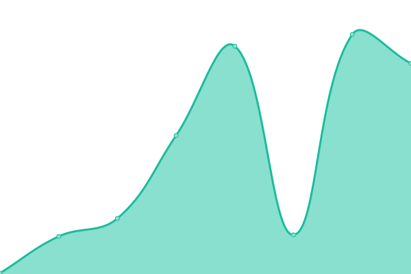
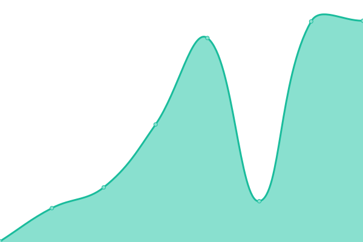
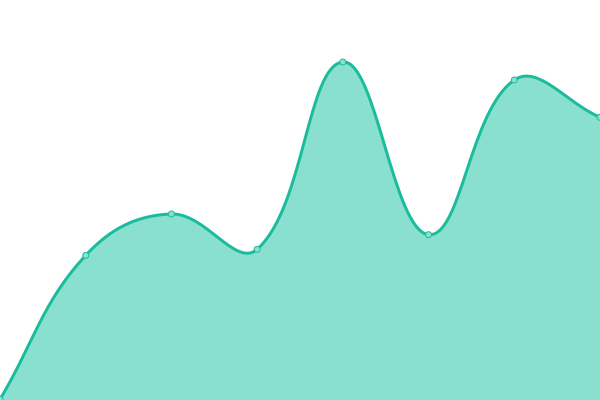
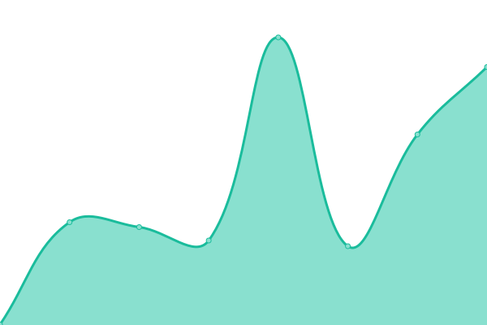
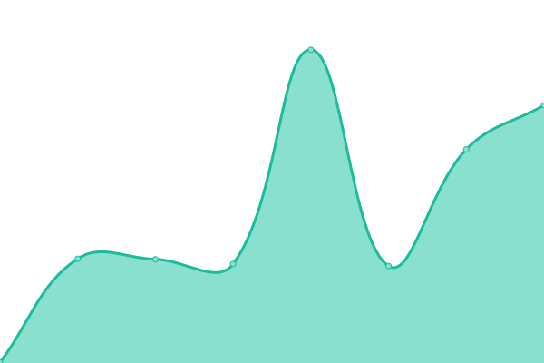

# [📈 Live Status](https://status.genni.com/): <!--live status--> **🟩 All systems operational**

This repository contains the open-source uptime monitor and status page for [songfluencertech](https://status.genni.com/), powered by [Upptime](https://github.com/upptime/upptime).

With [Upptime](https://upptime.js.org), you can get your own unlimited and free uptime monitor and status page, powered entirely by a GitHub repository. We use [Issues](https://github.com/songfluencertech/status_page/issues) as incident reports, [Actions](https://github.com/songfluencertech/status_page/actions) as uptime monitors, and [Pages](https://status.genni.com/) for the status page.

<!--start: status pages-->
<!-- This summary is generated by Upptime (https://github.com/upptime/upptime) -->
<!-- Do not edit this manually, your changes will be overwritten -->
<!-- prettier-ignore -->
| URL | Status | History | Response Time | Uptime |
| --- | ------ | ------- | ------------- | ------ |
|  [Genni Marketing API](https://portalapi.genni.com/api/v1/health-check) | 🟩 Up | [genni-marketing-api.yml](https://github.com/songfluencertech/status_page/commits/HEAD/history/genni-marketing-api.yml) | 

 134ms
     
 | 

<a href="https://status.genni.com/history/genni-marketing-api">100.00%</a>
    

|  [Genni Creator API](https://api.genni.com/) | 🟩 Up | [genni-creator-api.yml](https://github.com/songfluencertech/status_page/commits/HEAD/history/genni-creator-api.yml) | 

 192ms
     
 | 

<a href="https://status.genni.com/history/genni-creator-api">100.00%</a>
    

|  [Reports API](https://api.songfluencer.me/) | 🟩 Up | [reports-api.yml](https://github.com/songfluencertech/status_page/commits/HEAD/history/reports-api.yml) | 

 223ms
     
 | 

<a href="https://status.genni.com/history/reports-api">100.00%</a>
    

|  [Genni Creator Portal](https://www.genni.com/) | 🟩 Up | [genni-creator-portal.yml](https://github.com/songfluencertech/status_page/commits/HEAD/history/genni-creator-portal.yml) | 

 231ms
     
 | 

<a href="https://status.genni.com/history/genni-creator-portal">100.00%</a>
    

|  [Genni Connected Partner Portal](https://portal.genni.com/sign-in) | 🟩 Up | [genni-connected-partner-portal.yml](https://github.com/songfluencertech/status_page/commits/HEAD/history/genni-connected-partner-portal.yml) | 

 250ms
     
 | 

<a href="https://status.genni.com/history/genni-connected-partner-portal">100.00%</a>
    

<!--end: status pages-->

[**Visit our status website →**](https://status.genni.com/)

## 📄 License

- Powered by: [Upptime](https://github.com/upptime/upptime)
- Code: [MIT](./LICENSE) © [songfluencertech](https://status.genni.com/)
- Data in the `./history` directory: [Open Database License](https://opendatacommons.org/licenses/odbl/1-0/)
